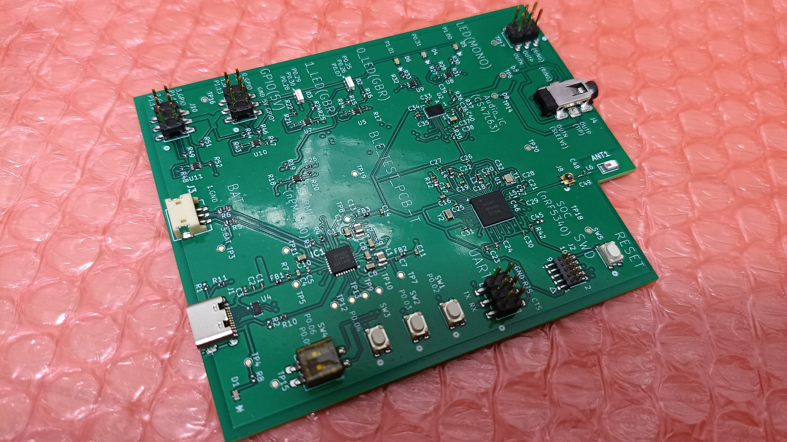

# Sonic-Sprint
This repository present solution for the Sonic Sprint

[Board Designer Competition](https://www.hackster.io/contests/board-designer).

## Introduction
**First of all thank you to Nordic Semiconductor, Autodesk, PCBWay and hackster.io for hosting this exciting competition.**

The main project is primarily summarized on hackster.io, so please refer to it there 

[Maker's nRF54L15 Debug Board](https://www.hackster.io/iotengineer22/maker-s-nrf54l15-debug-board-1a6a88)

In this project, we provide Maker's nRF54L15 Debug Board. We have designed a compact board featuring the powerful nRF54L15 Wireless SOC.

## Structure
    .
    ├── pcb                 # PCB files(autodesk, gerber, bom, schematics)   
    ├── src                 # Program and board files (program, board)   
    ├── LICENSE
    └── README.md

## Electrical Diagram overview

This is Main electrical diagram.

**For details, see the PDF file.**
[PDF schematics](pcb/schematics)

## PCB ArtWork overview

This is Artwork overview.

**For details, see the PCB files in Autodesk Fusion or Gerber data.**

[Autodesk_project_file](pcb/autodesk)

[Gerber_data](pcb/gerber)

## PCB BOM

This is BOM overview.

**For details, see the BOM data(.xlsx).**

[BOM_file](pcb/bom)

