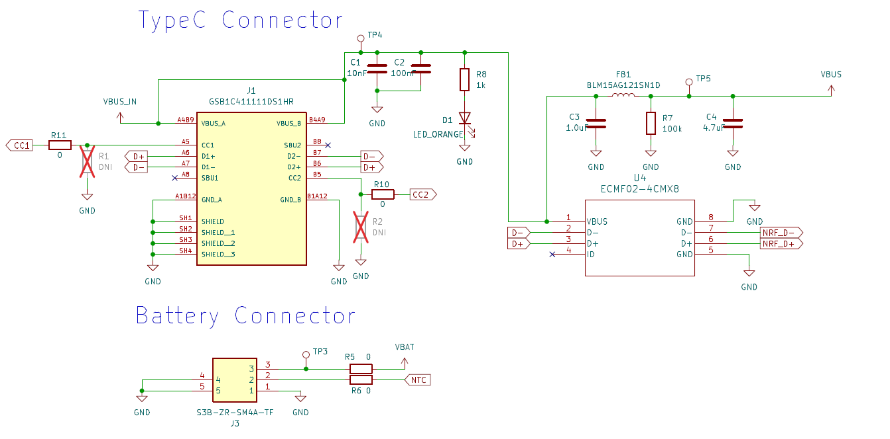
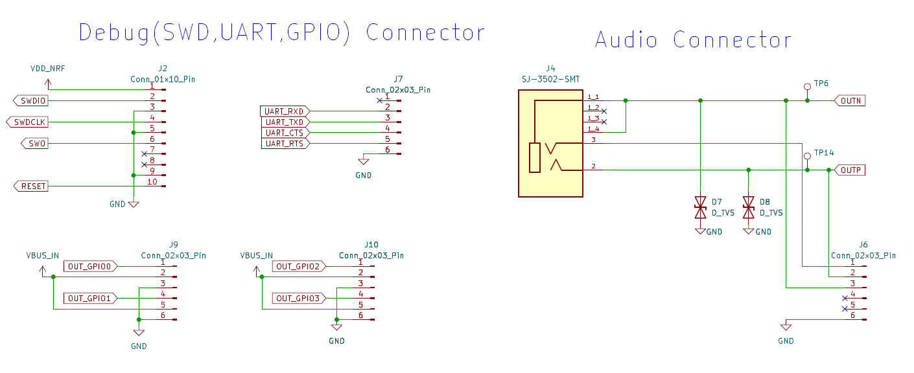
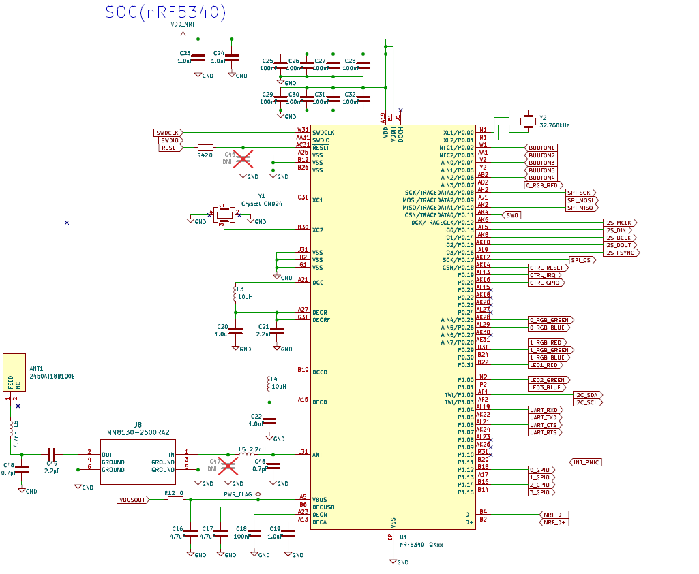
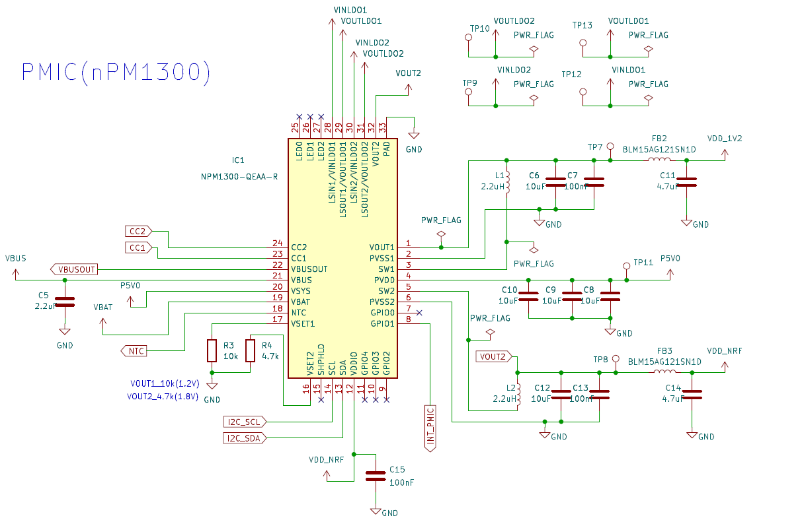
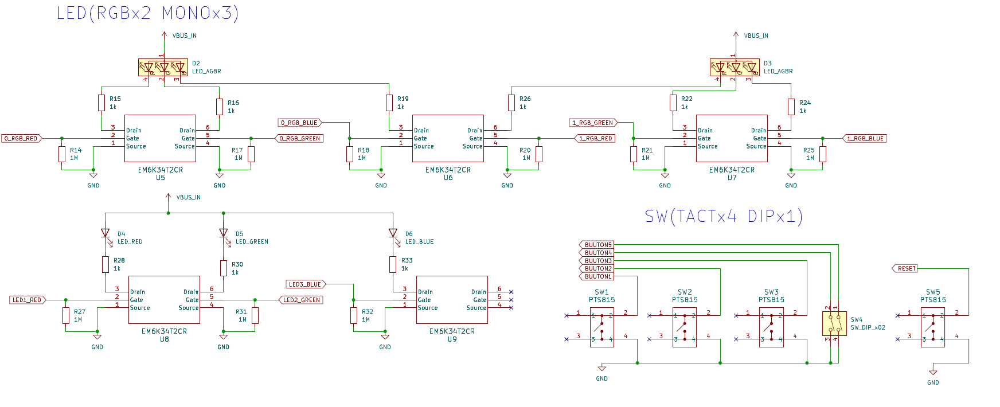
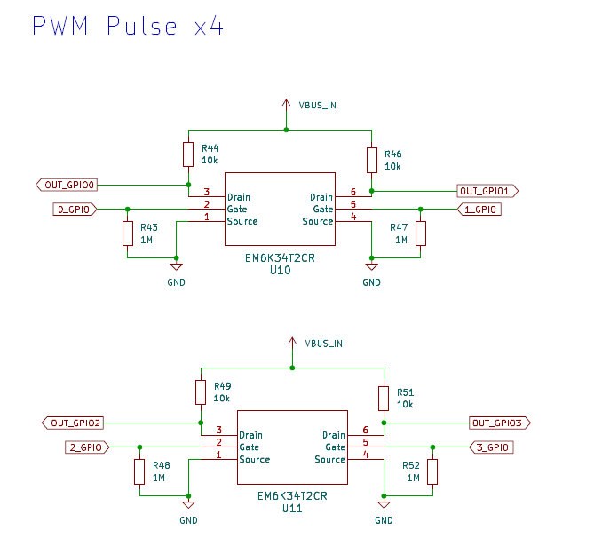
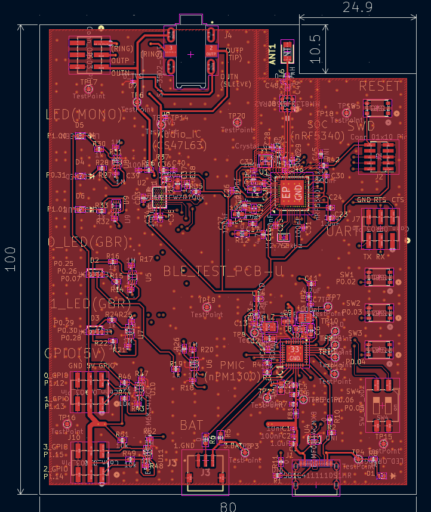
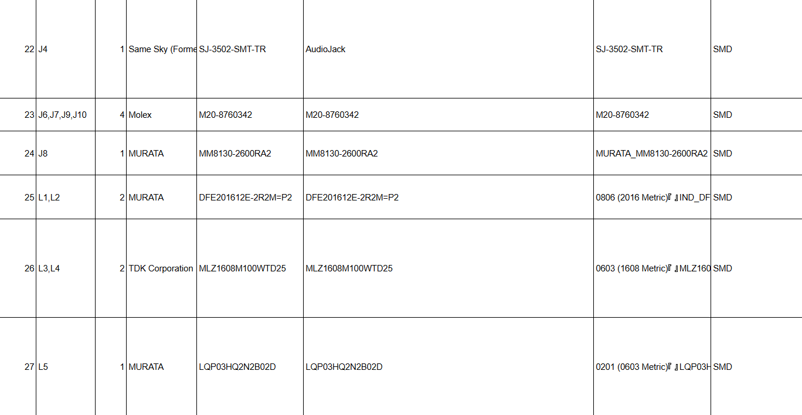
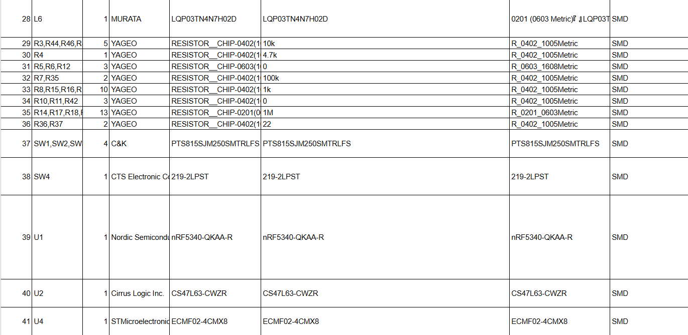
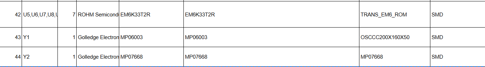

# Sonic-Sprint
This repository present solution for the Sonic Sprint

[Sonic Sprint](https://www.hackster.io/contests/SonicSprint).

## Introduction
**First of all thank you to Nordic Semiconductor, PCBWay and hackster.io for hosting this exciting competition.**

The main project is primarily summarized on hackster.io, so please refer to it there 

[Adaptive Directional BLE Audio Speaker](https://www.hackster.io/iotengineer22/adaptive-directional-ble-audio-speaker-2d892d)

This project introduces an innovative approach to broadcast audio in public and semi-public environments, leveraging nRF5340 and BLE Audio.

## Structure
    .
    ├── pcb                 # PCB files(KiCad, gerber, bom, schematics, EQ)   
    ├── src                 # Program and board files (program, board)   
    ├── LICENSE
    └── README.md

## Electrical Diagram overview

This is Main electrical diagram.

**For details, see the PDF file.**
[PDF schematics](pcb/schematics)

## PCB ArtWork overview

This is Artwork overview.

**For details, see the PCB files in KiCad or Gerber data.**

[KiCad_project_file](pcb/kicad)

[Gerber_data](pcb/gerber)

multi-layer

1-layer

## PCB BOM

This is BOM overview.

**For details, see the BOM data(.xlsx).**

[BOM_file](pcb/bom)

